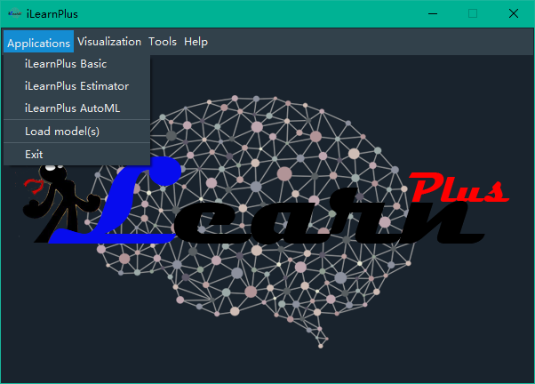
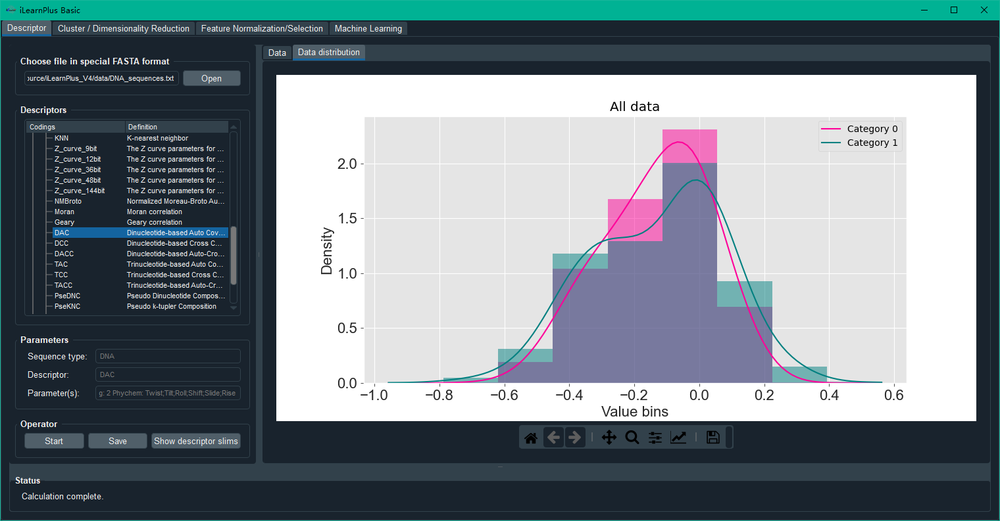
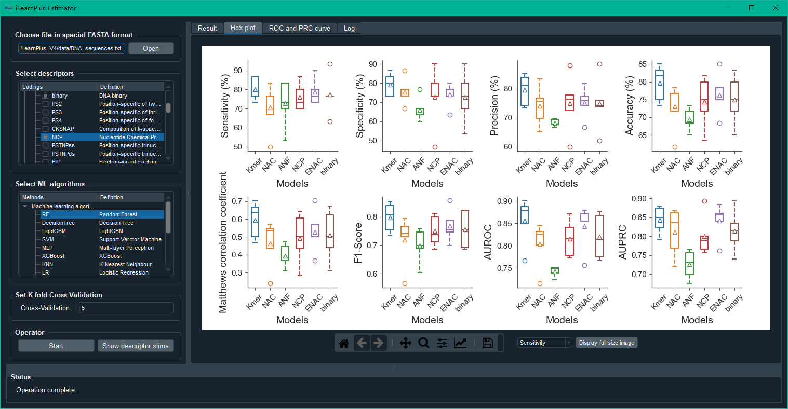
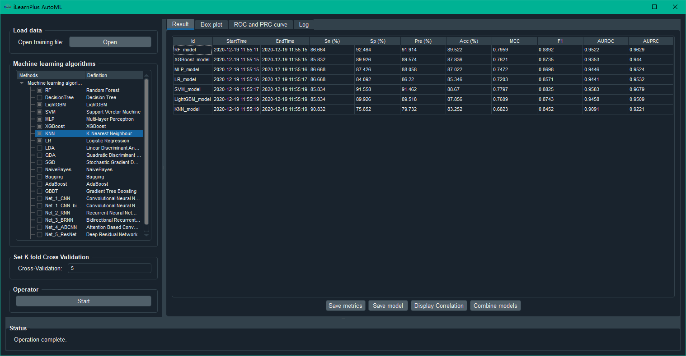
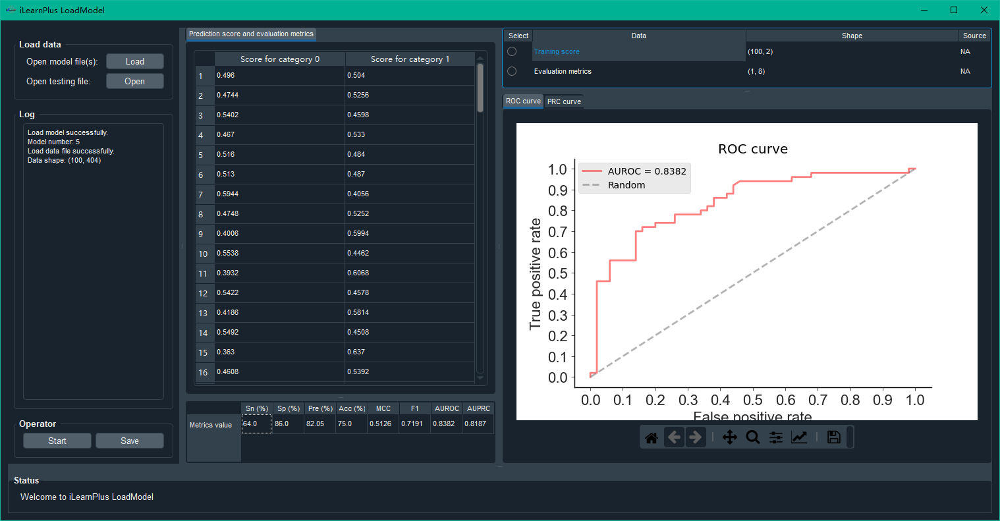
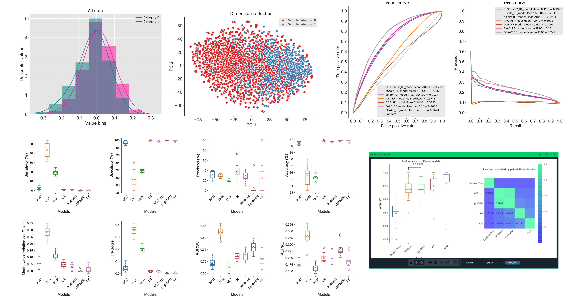

# *iLearnPlus*: a comprehensive and automated machine-learning platform for nucleic acid and protein sequence analysis, prediction and visualization. 
*iLearnPlus* is the first machine-learning platform with both graphical- and web-based user interface that enables the construction of automated machine-learning pipelines for computational analysis and predictions using nucleic acid and protein sequences. Four major modules, including iLearnPlus-Basic, iLearnPlus-Estimator, iLearnPlus-AutoML, and iLearnPlus-LoadModel, are provided in iLearnPlus for biologists and bioinformaticians to conduct customizable sequence-based feature engineering and analysis, machine-learning algorithm construction, performance assessment, statistical analysis, and data visualization, without additional programming. iLearnPlus integrates 21 machine-learning algorithms (including 12 conventional classification algorithms, two ensemble-learning frameworks and seven deep-learning approaches) and 19 major sequence encoding schemes (in total 152 feature descriptors), outnumbering all the current web servers and stand-alone tools for biological sequence analysis, to the best of our knowledge. In addition, the friendly GUI (Graphical User Interface) of *iLearnPlus* is available to biologists to conduct their analyses smoothly, significantly increasing the effectiveness and user experience compared to the existing pipelines. iLearnPlus is an open-source platform for academic purposes and is available at https://github.com/Superzchen/iLearnPlus/. The iLearnPlus-Basic module is online accessible at http://ilearnplus.erc.monash.edu/.
# Installation

  - Download *iLearnPlus* by 
  ```sh
  git clone https://github.com/Superzchen/iLearnPlus
  ```
  *iLearnPlus* is an open-source Python-based toolkit, which operates in the Python environment (Python version 3.6 or above) and can run on multiple operating systems (such as Windows, Mac and Linux). Prior to installing and running *iLearnPlus*, all the dependencies should be installed in the Python environment, including sys, os, re, PyQt5, qdarkstyle, numpy (1.18.5), pandas (1.0.5), threading, sip, datetime, platform, pickle, copy, scikit-learn (0.23.1), math, scipy (1.5.0), collections, itertools, torch (≥1.3.1), lightgbm (2.3.1), xgboost (1.0.2), matplotlib (3.1.1), seaborn,  joblib, warnings, random, multiprocessing and time. In addition, the Qt GUI framework must be installed in your machine and configured correctly. **For convenience, we strongly recommended users to install the Anaconda Python environment (The Qt GUI framework is built in) in your local computer. The software can be freely downloaded from https://www.anaconda.com/.**
# For users who want to use *iLearnPlus* package :
cd to the *iLearnPlus* folder which contains iLearnPlus.py and run the ‘iLearnPlus.py’ script as follows:
```sh
python iLearnPlus.py
```
## *iLearnPlus* interfaces:

*iLearnPlus* main interface:



*iLearnPlus-Basic* module interface:


*iLearnPlus-Estimator* module interface:


*iLearnPlus-AutoML* module interface:


*iLearnPlus-LoadModel* module interface:


*iLearnPlus* Data visulaization:
